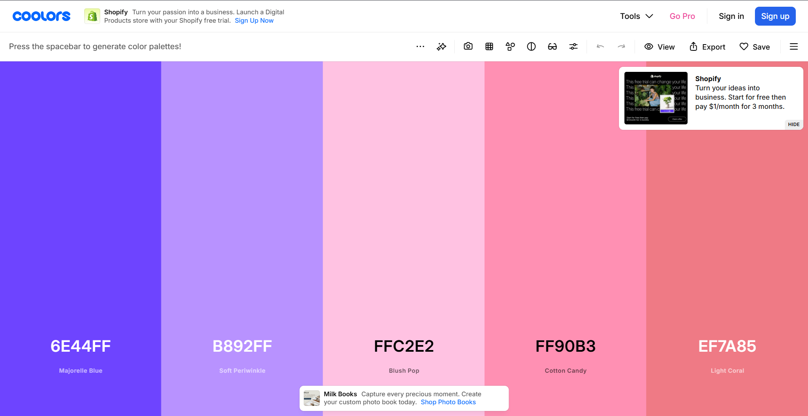
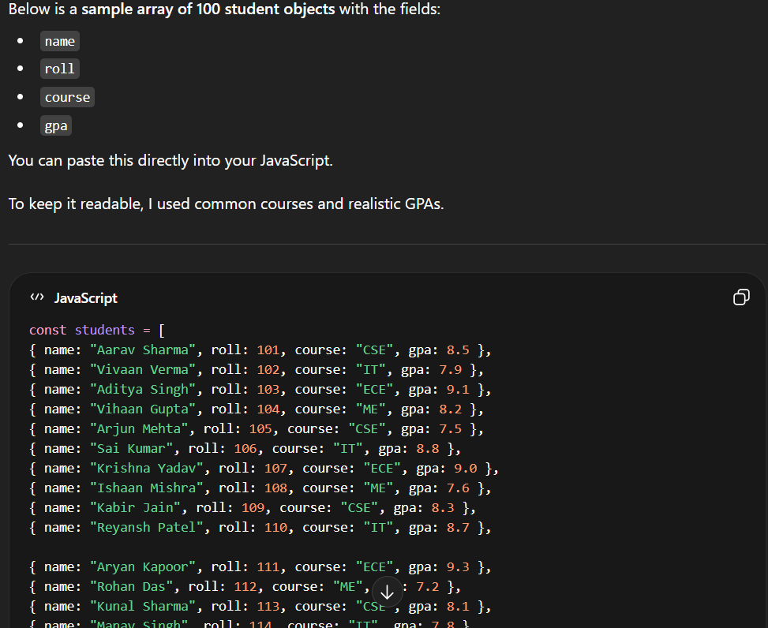

I am honoured to read that you think this code is AI generated because i spent more than 3 hours on perfecting it as much as possible.
I have completed all html and css lectures and assesments and i have done everything myself.
All the previous comments that i added that were quoted as over-explained and AI generated were also i written by me only.
I guess i am on the right track then. 

Here is the complete explanation of my whole progression.
first i started with frontend.
I went to coolers.com to select the color pallete for my website (ScreenShot attached below).

I created all the css variables from those color pallete.
then i started with index.html file and created the header section with navbar and two divs inside nav for username and login.
then i styled then and used all the necessary properties i learned from lectures. The css styling that you quoted as advanced, I learned from the lectures only.

then I further created a searchbar using form input and a button for which i used fontawsome website, for which i added the link tag
    <link rel="stylesheet" href="https://cdnjs.cloudflare.com/ajax/libs/font-awesome/6.5.0/css/all.min.css" />
    in the head tag of index.html and <i class="fa-brands fa-searchengin"></i> in the button tag.

then i styled it again using css for better UI.

then atlast i started with js.
first i created a div container with id="cardContainer".
in the script.js file i first created the students array (Here i used chatgpt to write 100 values initially but later i figured 100 is too much so i reduced it to 50.)
SS below

then i started with the display cards function where my initial thought was to use for loops to iterate through each entry and use render method to render the cards div, but later i remembered the same thing can be done using map() method, that will return an array that can be displayed using join method. 
so i went with map () method.

then i created the filter for the searchbar which uses filter() method from arrays to filter based on input values.

>>>>>>>>> How to Run in Browser.
step 1: clone the repository in you machine.
step 2: add live server extension in vs code.
step 3: open project folder.
step 4: click go live in the bottom right corner of the vs code window. 